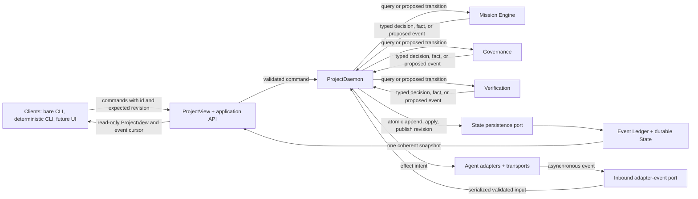
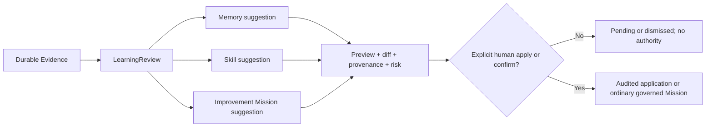

# AgentDeck V1 Kernel Reset Architecture

This document translates the authoritative
[`agentdeck-v1-prd.md`](../product/agentdeck-v1-prd.md) into V1 system
boundaries. The PRD remains authoritative for product scope, state precedence,
fallback safety, and Verification semantics. This architecture assigns those
semantics to components; it does not add another lifecycle or expand V1.

## Architecture decision

AgentDeck V1 is an **evolutionary kernel reset**. It is neither a greenfield
rewrite nor another round of M2c patching. Existing behavior is retained only
when it can converge on one authority and the V1 domain model behind tested
application boundaries. Historical M2c code and evidence may guide migration,
but they do not define the new kernel or block the ordered V1 program.

The reset preserves and converges these useful foundations:

- the project-scoped `Conversation` as the sustained user interaction surface;
- `ProjectView` as the read-only client projection;
- the project daemon as the background continuation and recovery authority;
- the append-only communication and activity ledger;
- explicit approval and permission lineage;
- ACP-first execution with governed CLI/PTY fallback and tmux visibility;
- reviewable skills, memory, and evidence-derived learning.

The convergence rule is simple: there is one command path into the
`ProjectDaemon`, one durable event/state authority, and one projection path out
to every client. Existing modules may be wrapped, replaced, or moved through
tested vertical slices, but no compatibility path may become a second writer,
scheduler, lifecycle, or acceptance authority.

## Component boundary



| Boundary | Owns | Does not own |
| --- | --- | --- |
| Clients | Human interaction, rendering, command submission, reconnect cursor, and explicit confirm/deny/cancel/takeover actions | Product state writes, scheduling, completion, transport inference, or terminal-pixel truth |
| ProjectView and application API | Stable command DTOs, validation, command identity/revision checks, read-only ProjectView projection, and compatibility facades | Independent state, execution, policy decisions, or direct adapter access |
| ProjectDaemon | The serialized command and inbound-event mutation loop, sole write authority, Task scheduling, recovery orchestration, leases, adapter-event validation, persistence calls, and event publication | Model-authored policy, client rendering, transport-specific semantics, or arbitrary acceptance overrides |
| Mission Engine | Pure interpretation of frozen MissionVersions, dependency-aware Task DAG progression, Attempt/Handoff decisions, and bounded recovery proposals returned to the daemon | Append/apply/repository access, permission expansion, confirmation, direct effects, or Verification grades |
| Governance | Pure evaluation of AuthorizationEnvelopes, permission lineage, scope/budget gates, ordered-route eligibility, and pause/failure classification returned to the daemon | Append/apply/repository access, Task implementation, model selection by guess, or completion |
| Verification | Pure deterministic evaluation of durable Evidence against frozen acceptance criteria, returning `pass`/`fail`/`unavailable` grades to the daemon | Append/apply/repository access, Worker self-attestation, reviewer authority, transport status, or amendment approval |
| State persistence port, Event Ledger, and durable State | Atomic append/apply/revision publication requested only by the daemon; append-only intent/outcome facts, current materialized state, revisions, idempotency records, cursors, provenance, and recovery evidence | Direct calls from kernel decision services or adapters, policy invention, scheduling, transport calls, or client-specific projections |
| Agent adapters and transports | Protocol translation, session/effect execution, asynchronous ordered progress/result events, and transport evidence submitted through the inbound adapter-event port | State/repository writes, Mission semantics, authorization, fallback choice, Task completion, or state transitions |

The daemon invokes the Mission Engine, Governance, and Verification as pure
domain/application decision services. They return typed decisions, facts, or
proposed events and have no append, apply, repository, or publication
capability. Only the ProjectDaemon calls the state persistence port to
atomically append accepted events, apply current state, and publish the new
revision. The daemon alone records the resulting transition. Adapters report
facts through a port and cannot write state. They never turn a provider
response, process exit, or terminal marker into product truth.

## Domain model and invariants

| Model | V1 responsibility |
| --- | --- |
| `Project` | Root identity and local boundary for one Conversation, one daemon authority, configuration, ledger, and at most one concurrently mutating Mission |
| `Conversation` | Durable project-scoped sequence for setup, Mission creation/revision, confirmation, progress, intervention, results, and learning review |
| `Mission` | Stable identity for the user's governed goal across immutable versions |
| `MissionVersion` | Immutable goal, scope, exclusions, DAG proposal, constraints, criteria, limits, route order, expiry, provenance, and authorization digest |
| `AuthorizationEnvelope` | Exact authority frozen into one confirmed MissionVersion: semantic/path scope, operation classes, Agent constraints, external-effect policy, budgets, retries, acceptance, and permitted ordered routes |
| `Task DAG` | Dependency-aware units inside one MissionVersion, including role, scope, acceptance contribution, and concurrency constraints |
| `Attempt` | One distinguishable bounded try for one Task, Agent, model, transport, session, and route position; retries, splits, and reassignments never overwrite it |
| `AgentSession` | Reconnectable Worker execution context with Agent/model/transport provenance, lease, ordered protocol progress, takeover state, and reconciliation facts |
| `Permission` | An operation decision linked to the exact MissionVersion, Task, Attempt, AgentSession, requested operation, scope, and outcome |
| `Handoff` | AgentDeck-owned cross-Worker transfer identifying source and destination work, artifacts, Evidence, acceptance state, and provenance |
| `Evidence` | Durable artifact, diff/hash, command/test result, review finding, or external-effect fact with source and lineage |
| `VerificationResult` | Deterministic grades and reasons for frozen acceptance checks, plus the aggregate completion decision |
| `LearningReview` and suggestions | Evidence-derived review that may propose Memory, Skill, or Improvement Mission changes without applying or authorizing them |

The kernel enforces these invariants verbatim:

- The ProjectDaemon is the only product-state writer.
- Confirmation binds one exact Mission version and authorization digest.
- Leader output is a proposal, never state-transition authority.
- Worker completion text is not Task completion authority.
- Workers learn upstream completion only through AgentDeck Handoffs.
- ACP, CLI/PTY, and tmux do not own Mission semantics.
- Skills and memory are context, never permission authority.
- Recovery never asks a model to guess whether an external effect happened.

Additional structural consequences follow from those invariants:

- one project has at most one concurrently mutating Mission, while independent
  Tasks within it may run concurrently only when dependency, shared-scope,
  authorization, route, and budget constraints all allow it;
- every mutation is attributable to a command, an expected revision, an
  authorization decision, and one or more append-only intent/outcome events;
- every cross-Worker dependency becomes a durable Handoff rather than informal
  terminal text;
- every claimed completion resolves through durable Evidence and Verification,
  never through an adapter, Agent, reviewer, or client heuristic.

## ProjectDaemon and recovery

Exactly one `ProjectDaemon` owns the project command loop and all product-state
writes. A local client may start it, reconnect to it, or ask it to shut down,
but closing a client does not pause or cancel a confirmed Mission. If an OS
lock, socket ownership, or durable daemon lease shows another live writer, the
new process must refuse mutation rather than compete.

Every mutating application command carries a stable `command_id` and
`expected_revision`. The daemon atomically records command acceptance and the
resulting events. Replaying a completed `command_id` returns its recorded
outcome; reusing it with different input fails closed; a stale expected
revision returns a conflict and the current revision. This makes reconnect and
client retry idempotent without making effects implicitly safe to repeat.

The project daemon control endpoint is local owner-only and authenticated. The
exact Unix socket permissions, credential exchange, and peer-identity mechanics
are deferred to P1, but filesystem locality alone is not authentication.
Confirmation, Mission Amendment, cancel, takeover, return-control, shutdown,
permission, and every other explicit-human mutation command retain actor
provenance and pass command authorization before entering the mutation loop.
Read-only observation is distinct from mutation authority.

The ProjectDaemon also owns one inbound adapter-event port. Every asynchronous
Worker or transport event carries a stable `adapter_event_id`; exact Mission,
MissionVersion, Task, Attempt, and AgentSession lineage; per-session and
per-Attempt ordering information; event kind; and a payload integrity identity.
The wire schema is deferred, but these facts are mandatory at the boundary.
Adapters and transports cannot write state or apply a transition themselves.

Inbound adapter events enter the same serialized daemon mutation loop as
client commands. The daemon validates event identity, lineage, ordering, kind,
and integrity; deduplicates replays; and rejects or safely holds gaps,
out-of-order events, and conflicting identities for reconciliation. It then
persists the accepted event and resulting state transition atomically through
the state persistence port. Duplicate valid events are idempotent. Stale
terminal, permission, or Evidence events remain audit observations and cannot
reactivate terminal work, repeat a permission transition, double-apply an
effect, or duplicate Evidence credit.

The daemon enforces one running Mission per project. It may schedule multiple
ready Tasks from that Mission when the DAG, file/semantic scope, permissions,
budgets, Agent capacity, and shared resources do not conflict. It preserves a
monotonic event cursor so reconnecting clients can request events after their
last cursor and then refresh one coherent ProjectView snapshot.

Every external operation has a durable intent before dispatch and a durable
outcome after observation. Intent records include the MissionVersion,
authorization digest, Task, Attempt, AgentSession, operation identity,
idempotency classification, route, and lease. Outcome records distinguish
known effect, proven no effect, reconciled idempotent/consume-once effect,
refusal, and ambiguous effect. Absence of an outcome is not proof of no effect.

AgentSession and Attempt leases prevent two schedulers from driving the same
work. Expiry means ownership is lost, not that an effect failed or did not
happen. On daemon restart the recovery loop:

1. rebuilds materialized state from durable facts and validates revisions;
2. preserves absorbing terminal `completed`, `failed`, or `cancelled` states;
3. reconciles accepted commands with missing outcomes and active leases;
4. reconnects to sessions where identity and protocol continuity are proven;
5. classifies lost or ambiguous work from durable facts using the PRD's one
   exclusive transition matrix;
6. resumes only work with a proven-safe continuation inside the frozen
   envelope, otherwise records the precise pause or terminal failure.

Recovery never delegates classification to a model. It never equates lease
expiry, timeout, lost process, stale pane, or provider prose with effect
outcome. An ambiguous external effect causes zero new dispatch and a
Mission-wide reconciliation pause.

Storage mechanics, schema, transaction boundaries, JSON-to-SQLite sequencing,
and rollback details belong to Task 4's dedicated SQLite migration document.
The one-authority boundary and required transactional behavior are fixed here
regardless of the backing store.

## Leader and Worker adapters

Role, Agent, model, and transport are separate facts:

- a **role** is responsibility such as Leader, Worker, or reviewer;
- an **Agent** is the official Codex or Claude integration selected for that
  responsibility;
- a **model** is the exact configured model identifier used for an Attempt;
- a **transport** is ACP or one governed CLI/PTY route; tmux is an optional
  observation/takeover binding, not a transport identity.

The Leader is always explicitly selected and shown with exact Agent/model
provenance. It consumes a frozen user goal and ProjectView context and proposes
MissionVersions, Task DAG changes, Worker/reviewer assignments, and bounded
recovery within the envelope. It cannot mutate product state, dispatch a
Worker, approve authority, confirm a Mission, decide permission, grade
Verification, or mark a Task/Mission complete. The application service parses
and validates its proposal; the daemon and governance kernel decide whether a
state transition or effect is legal.

A Worker receives a versioned `TaskEnvelope` containing MissionVersion and
authorization lineage, Task and Attempt identity, its explicit role/Agent/
model/transport, scoped inputs and Handoffs, limits, permitted operations, and
expected result/evidence schema. It emits ordered adapter events for progress,
permission requests, artifacts, Evidence, review findings, and terminal
protocol outcomes. Worker text such as "done" is only an observation.

Adapter interfaces are capability-oriented and transport-neutral. Future
official Agents or transports must implement the same proposal, TaskEnvelope,
event, permission, cancellation, and reconciliation ports. Adding one must not
require `if provider == ...` or `if transport == ...` branches in Mission,
governance, Verification, ledger, or recovery code. V1 product acceptance,
however, remains deliberately limited to Codex and Claude.

## ACP, CLI/PTY, and tmux

ACP is the preferred structured protocol because it can preserve session,
request, permission, progress, and result lineage. A governed CLI/PTY adapter
is the permitted fallback for an Agent/operation only when that exact ordered
route appears in the frozen AuthorizationEnvelope. tmux provides observation,
human takeover, and optional session attachment; it never supplies completion,
permission, Handoff, or effect truth.

Fallback order is frozen and deterministic. The daemon may advance from one
route to the next only when the failed route and next route are both in the
confirmed order and one of these proofs exists:

1. durable Evidence proves the first route produced no operation effect; or
2. the exact operation was declared idempotent or consume-once before dispatch,
   and reconciliation proves retry cannot duplicate or conflict with an
   existing effect.

Before or at activation, the ledger records the failed route, a stable reason
code, and the selected route. A timeout, lost connection, unknown process, or
missing response is never proof. If any prior effect is ambiguous, the daemon
creates zero fallback Attempt and zero fallback effect, suspends all new
Mission dispatch, and enters a Mission-wide reconciliation pause for durable
fact inspection and an explicit user decision.

The adapter failure taxonomy is closed at the kernel boundary:

| Failure class | Durable meaning | Kernel consequence |
| --- | --- | --- |
| `readiness_unavailable` | The selected Agent/model/route cannot start | No silent substitution; actionable pause or terminal classification from all facts |
| `protocol_refused` | The route explicitly refused before effect | Record refusal; consider only the next frozen route under governance |
| `proven_no_effect` | Durable protocol or project Evidence proves no effect | A pre-approved next route may be selected if all higher gates pass |
| `reconciled_idempotent` | A predeclared idempotent/consume-once operation is proven safe to continue | A pre-approved next route may be selected without duplicate/conflict risk |
| `ambiguous_effect` | Timeout, disconnect, lost process, partial protocol, or conflicting facts leave effect unknown | Zero fallback; Mission-wide reconciliation pause |
| `route_exhausted` | Prior effects are safe but no approved route remains | Zero new Worker effect; actionable pause if remediation/amendment exists, otherwise terminal classification |
| `lineage_invalid` | Session, Attempt, permission, sequence, or Handoff identity does not match | Reject the event/effect and classify without trusting adapter prose |

Human takeover suspends automated input to that AgentSession. Returning control
requires session/effect reconciliation and a valid continuation or Handoff;
reattaching a tmux pane alone does not resume automation.

## Governance and verification

`AuthorizationEnvelope` is the immutable, digest-bound authority for an exact
MissionVersion. It contains goal and semantic/path scope, exclusions,
operation classes, Agent and role constraints, ordered routes, external-effect
policy, budgets, retry/recovery bounds, acceptance criteria, and expiry where
applicable. The developer confirms that exact version and digest once. After
confirmation, fully in-envelope work requires zero additional human decisions,
including ordinary permission requests already represented by the envelope.
New scope, authority, model, route, waived check, lowered criterion, or expanded
limit requires a lineage-preserving Mission Amendment, new version/digest, and
explicit confirm, deny, or cancel outcome.

Every permission decision retains lineage to the MissionVersion, digest, Task,
Attempt, AgentSession, requested operation, exact scope, and decision. A prior
permission or contextual instruction cannot authorize a different effect.
Skills, memory, prompts, adapter capabilities, and control IDs provide context
or affordances only; they never grant permission.

Recovery is bounded by the frozen envelope. Retry, reassign, split, replan, or
fallback may proceed automatically only inside scope, budget, retry bounds,
acceptance criteria, and approved route order. It may never widen scope, lower
standards, change models, or continue through ambiguous effect.

State classification carries the PRD semantics unchanged:

1. terminal `completed`, `failed`, and `cancelled` states are absorbing;
2. all simultaneously active durable facts are evaluated in one coherent
   snapshot, and every fact/reason is retained even when a higher-precedence
   fact determines the effective state and scope;
3. terminal-failure facts cannot be masked by actionable pauses, and
   Mission-wide authority/project-truth blockers outrank Task-local blockers,
   which outrank session-local takeover: **Mission > Task > Session**;
4. session-only continuation is never selected while a higher-scope blocker is
   active, and unrelated Tasks continue only without dependency, shared-scope,
   or authority conflict;
5. `running` or `recovering` is selected only for bounded recovery proven safe
   inside the envelope with no blocking fact at any higher precedence.

Effective state and scope use precedence; they do not erase observations.
The audit record and ProjectView retain every simultaneous durable fact and
reason, including Task-local failures and session takeover facts masked by a
selected Mission-wide pause or terminal state. Those lower-scope facts remain
non-authoritative for the selected transition but available for explanation,
reconciliation, and later classification from a new coherent snapshot.

Thus takeover plus authorization revocation is one Mission-wide `paused`
classification with zero new dispatch, while terminal `failed` plus a later
takeover remains `failed`. A generic `BLOCKED` state is not a substitute for a
precise actionable pause or terminal failure.

Verification is a separate AgentDeck-owned deterministic service. It evaluates
durable Evidence against every acceptance criterion frozen into the
MissionVersion. Each required check receives `pass`, `fail`, or `unavailable`
with a durable reason. Reviewer Agents may contribute findings and Evidence;
they do not own grades or completion. Worker output, reviewer approval, a
process exit, terminal marker, or changed file cannot complete work.

A mandatory `fail` or `unavailable` grade blocks Task and Mission completion.
The only way to waive a mandatory check or lower a criterion is a confirmed
Mission Amendment with a new version/digest and recorded rationale. No user,
Leader, Worker, reviewer, adapter, or test helper may override Verification on
the already confirmed version.

## Learning lifecycle



Completed, meaningfully paused, and terminally failed Missions are all eligible
for an evidence-derived `LearningReview`. The review may produce only Memory,
Skill, or Improvement Mission suggestions. Every suggestion identifies source
Evidence, rationale, destination, provenance, proposed content or diff,
expected benefit, and risk.

Suggestion generation and durable application are separate transitions. The
user must preview and explicitly apply Memory/Skill changes; an Improvement
Mission must enter the ordinary preview, frozen-version confirmation,
governance, and Verification path. Learning never silently changes code,
expands permission, enables or loads a skill, writes durable memory, changes an
Agent/model/route, or starts follow-up work. Suggestions remain context, never
authority or mutation.

## Target dependency direction

The target package responsibilities and allowed dependency direction are:

```text
clients (bare CLI, deterministic CLI, future UI)
    -> application (commands, queries, ProjectView projections)
        -> daemon (single command loop, scheduling, recovery coordination)
            -> pure decision services
                -> mission (MissionVersion, DAG, Attempt, Handoff decisions)
                -> governance (AuthorizationEnvelope, Permission, precedence)
                -> verification (Evidence grading and completion decisions)
                -> learning (review and suggestion proposals)
            -> state persistence port (the only append/apply call path)
            -> outbound effect and inbound adapter-event ports
            -> clock/identity ports
infrastructure (SQLite, ACP, CLI/PTY, tmux observation)
    -> implements daemon-owned ports
```

Domain models and pure decision services depend only on domain types. They do
not receive a persistence port or repository and cannot append or apply state.
The daemon depends on those services and on ports; infrastructure implements
the ports and depends inward. Adapters never become imports inside the Mission
Engine, Governance, or Verification. Application projections may read an
authoritative snapshot but cannot mutate it except by sending daemon commands.
Only the daemon may call the state persistence port, including when an accepted
adapter event rather than a client command caused the proposed transition.

Current code converges as follows:

| Current surface | Target responsibility |
| --- | --- |
| `src/agentdeck/cli.py` | Current legacy handlers directly call many `StateStore.record_*`/`append_event` methods, schedule work, approve, and send tmux input. Characterize and cut over each mutating command to the daemon; retain the CLI only as an application delegate and projection renderer |
| `src/agentdeck/conversation/` | Preserve the sustained conversation and terminal UX, but remove current `conversation/session.py` direct `StateStore` creation/event writes and ensure Leader/runtime paths submit commands or adapter events through daemon-owned ports |
| `src/agentdeck/daemon/` | Converge lifecycle, protocol, service, scheduler, governance, lease, recovery, and transports on the single `ProjectDaemon` command loop and explicit ports |
| `src/agentdeck/daemon/client.py` | Remove unavailable-daemon local persistence such as `admit_confirmed_mission()` calling `record_mission_not_admitted()`; a daemon client reports deterministic unavailability and never becomes a fallback writer |
| `src/agentdeck/state.py` | Place behind the ledger/state port as a migration source and compatibility implementation; it must not remain a parallel writer once the new authority is active |
| `src/agentdeck/mission*.py`, `semantic_*.py`, `autonomy.py`, and `workflow.py` | Extract and converge MissionVersion, envelope, DAG, recovery, and application policies into deterministic kernel services rather than overlapping lifecycles |
| `src/agentdeck/providers/` and `src/agentdeck/orchestration/` | Implement Leader proposal and Worker adapter ports with explicit Agent/model provenance; provider-specific planning cannot mutate state |
| `src/agentdeck/runtime/acp*.py` | Implement the preferred structured transport port and emit ordered facts/Evidence only |
| `src/agentdeck/runtime/tmux.py` and current daemon/conversation transport helpers | Separate governed CLI/PTY execution from tmux observation/takeover; neither may own Mission truth |
| `src/agentdeck/contracts.py`, `models.py`, and CLI projection code | Continue ProjectView/contract compatibility while moving projection input to the one authoritative snapshot |

Migration proceeds only by tested vertical slice and per-command cutover:

1. characterize the legacy command's mutation, execution, failure, and
   projection behavior with deterministic evidence;
2. move its authoritative mutation behind a daemon command or inbound-event
   boundary and the daemon-only state persistence call;
3. rewire the legacy CLI or Conversation handler as a delegate to the shared
   application service;
4. verify the public command-to-daemon-to-ledger-to-ProjectView behavior,
   including unavailable-daemon and replay cases;
5. only then remove the direct state, scheduler, approval, or transport-input
   path.

Once a product fact is cut over, legacy code may not directly write that fact,
send its transport input, schedule it, or approve it. If the daemon is
unavailable, mutating commands refuse with a deterministic diagnostic; they
never fall back to local state mutation or direct execution. Read-only status
may use an explicitly designed safe projection when the daemon is unavailable,
but that projection cannot mutate, reconcile, infer new truth, or become a
second authority.

Each slice therefore enters the shared application service, mutates through
the daemon, records facts through the daemon-owned state port, and projects
through ProjectView before the next slice moves. Do not create empty package
scaffolding, perform a big-bang module move, or keep old and new writers alive
for convenience.
SQLite format and migration mechanics are specified in Task 4; this document
fixes only the dependency and authority boundary they must satisfy.

## Compatibility and client contract

ProjectView remains the read-only product contract. During migration, v1 and
future v2 are projections from the same authoritative state snapshot and event
cursor, not independently maintained stores. A v2 projection may add normalized
Mission-domain fields; a v1 projection may preserve legacy names and shapes.
Neither may infer authority, lifecycle, completion, Handoff, or Evidence from
terminal pixels or adapter prose.

The legacy CLI remains a facade over the same application command/query
service used by bare `agentdeck`. It must not bypass the daemon because a
legacy command once wrote `state.py` directly. Compatibility translates input
and output at the edge; it does not preserve unsafe internals.

The kernel is headless. A future GUI, browser client, or automation client may
subscribe by cursor, render ProjectView, and submit the same versioned commands
without adding product semantics. Deterministic status, recovery, audit,
permission, and Verification surfaces remain usable when no model is
available.

## Architecture acceptance and stop conditions

The reset is accepted incrementally at these program boundaries:

| Phase boundary | Architecture evidence required before advancing |
| --- | --- |
| **P1 — Durable Mission Kernel** | One authoritative daemon/state path; immutable MissionVersion and AuthorizationEnvelope; command idempotency/revision control; one mutating Mission with safe Task concurrency; ledgered intent/outcome; deterministic precedence and Verification unit/contract evidence |
| **P2 — Conversation Product** | Bare `agentdeck` and legacy CLI use one application service; reconnect restores the same Conversation, Mission, and cursor; ProjectView v1/v2 derive from one snapshot; preview/edit/one-confirmation and precise pause/failure journeys contain no client-side authority |
| **P3 — Official Agent adapters** | Explicit Codex and Claude Leader/Worker roles preserve Agent/model/transport lineage; ACP is preferred; governed CLI/PTY fallback proves no-effect or reconciled idempotency; ambiguous effect creates zero fallback and Mission-wide pause; core contains no adapter-specific branches |
| **P4 — Multi-Agent closure** | Dependency-aware concurrent Tasks, AgentDeck Handoffs, permission lineage, takeover/return-control reconciliation, peer Evidence, bounded revision, and deterministic Verification pass the real Golden Mission boundaries without making tests or reviewers authoritative |

Stop the migration and resolve the architecture violation if any slice creates:

- two product-state writers, two schedulers, or divergent ProjectView truths;
- Agent/provider/transport-specific branches in kernel Mission, governance,
  recovery, or Verification logic;
- automatic retry or fallback without proven no-effect or reconciled
  idempotent/consume-once safety;
- recovery based on model guessing, terminal pixels, lease expiry, or missing
  output;
- a test harness, reviewer, adapter, or compatibility facade acting as a
  second scheduler or completion authority;
- empty scaffolding, a big-bang move, or a slice that cannot prove the public
  command-to-ledger-to-ProjectView path;
- work from a later phase, including real adapter rollout before the kernel and
  conversation boundaries it depends on have passed.

These are stop conditions, not reasons to weaken the PRD. The next step is to
repair the current vertical slice and rerun its deterministic acceptance before
advancing.
