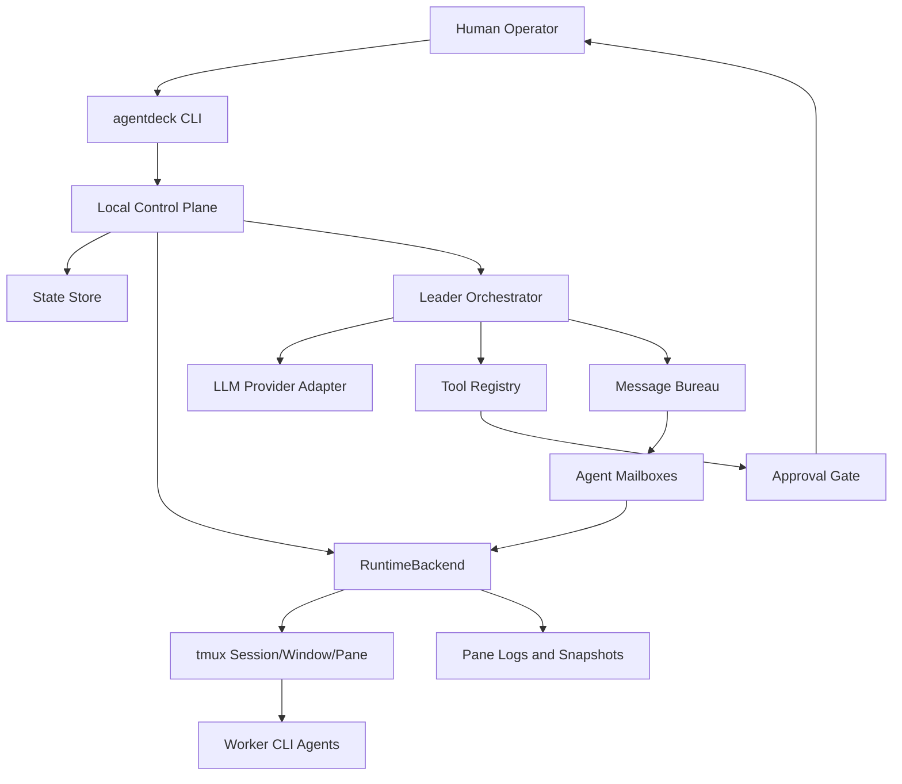

# Multi-Agent Terminal Architecture Design

> 项目代号：AgentDeck
> 设计来源：`docs/reference-analysis/` 下 WispTerm、Claude Codex Bridge、Hermes Agent、tmux 四份深度分析。
> 设计目标：把四个参考项目的长处融合成一个可落地的本地多智能体终端工作台，而不是复制任一项目的复杂度。

## 1. 一句话定位

AgentDeck 是一个 local-first 多智能体终端控制面：使用 DeepSeek 等 LLM 作为 Leader Agent，调度多个 Worker Agent，在 tmux 可见终端中执行任务，通过项目级状态、消息账本、审批闸门、技能上下文和可恢复 runtime 形成可审计的人机协作工作台。

## 2. 四个参考项目的职责分工

| 参考项目 | 应吸收的长处 | 本项目中的落点 | 暂不照搬的部分 |
| --- | --- | --- | --- |
| WispTerm | AI 原生终端 surface、本地控制 API、ToolContext、skills snapshot、权限分级 | `Surface`/`RuntimeBackend` 抽象、`panes/read/send/wait/spawn` 控制面、工具上下文与审批 | 自研 Zig 终端模拟器、GPU 字体渲染、完整远程 relay、IM 平台 |
| Claude Codex Bridge | agent-first 身份、message/attempt/job/reply 分层、mailbox 串行、tmux 可见 panes、ProjectView | 项目级 daemon/API、消息账本、每 agent 串行队列、reply 回流 inbox、ProjectView JSON | 15 provider 矩阵、复杂 callback edge、Rust accelerator、移动端 gateway |
| Hermes Agent | Leader/Worker 隔离、子代理 summary budget、tool registry、skills/memory、学习闭环、guardrails | Leader 规划与汇总、Worker 有限工具集、结构化结果、技能手动加载、验证提醒 | MoA、自动 skill curator、cron/gateway、execute_code RPC、全 provider catalog |
| tmux | 长期可见 PTY、session/window/pane、send/capture/pipe/control mode、respawn | MVP runtime 后端，提供可看、可输、可恢复的多 Agent 终端 | 修改 tmux 内核、重写 PTY/VT/grid/control 协议 |

核心取舍：先做“多 Agent 编排 + 可见终端 runtime + 可审计状态”，不要先做“完整终端模拟器”或“大而全个人 agent OS”。

## 3. 用户故事

1. 用户在一个代码仓库中执行 `agentdeck project init`，生成本项目的 agent 配置和状态目录。
2. 用户配置 DeepSeek 作为 Leader Agent，并配置多个 Worker，例如 `planner`、`coder`、`reviewer`。
3. 用户执行 `agentdeck run "实现一个功能"`。
4. Leader 读取项目上下文，拆解任务，生成可审批的任务计划。
5. 人类确认后，系统把任务投递到指定 Worker 的 tmux pane。
6. Worker 在独立 pane/session 中执行，输出被 capture/log，结果进入消息账本。
7. Leader 读取 Worker 的结构化结果、重新读取被改动文件、运行验证命令，并汇总给用户。
8. 所有消息、尝试、job、reply、审批、artifact 路径都可 trace。

## 4. 架构总览



## 5. 分层设计

### 5.1 CLI 层

职责：

- 提供用户入口：`doctor`、`project init`、`run`、`agent list`、`agent send`、`agent capture`、`queue`、`inbox`、`trace`。
- 不直接读写 tmux 作为系统事实，只调用 control plane。
- 输出机器可读 JSON 与人类可读表格两种形态。

MVP 先实现：

- `agentdeck doctor`
- `agentdeck project init`
- `agentdeck status`

### 5.2 Control Plane

职责：

- 项目级唯一 authority。
- 管理配置、状态、runtime binding、消息账本、审批记录。
- 后续可以从 CLI 进程内服务升级为 Unix socket daemon。

MVP 选择：

- 先用进程内 control service + `.agentdeck/state/state.json`。
- Phase 2 再引入 daemon/socket 或 HTTP loopback API。

原因：CCB 的 ccbd 很强，但一开始就做 daemon 会把调试复杂度拉高。先把数据模型和命令契约稳定，再 daemonize。

### 5.3 RuntimeBackend

职责：

- 把业务 agent 映射到真实终端运行资源。
- 提供 `doctor`、`create_session`、`spawn_agent`、`send_input`、`capture_output`、`list_agents`、`restart_agent`、`stop_session`。

第一后端：`TmuxBackend`。

关键约束：

- 固定项目级 socket 或 session name，避免误操作用户默认 tmux。
- 业务 ID 与 tmux pane ID 分离：`agent_id` 是业务 ID，`pane_id` 是 runtime handle。
- destructive 操作必须经过 approval gate。
- capture-pane 只是快照，不等同于完整执行日志；Phase 2 用 pipe-pane/control mode 补充。

### 5.4 Leader Orchestrator

职责：

- 使用 DeepSeek 或其他 LLM 做任务分解、角色指派、结果汇总。
- 保持用户目标、计划、审批与最终判断的上下文。
- 不把 Worker 的全部输出塞回上下文，只消费结构化 summary 和 artifact 路径。

来自 Hermes 的约束：

- Leader 保持上下文干净。
- Worker 使用有限工具集和独立 session。
- Worker 输出必须有 `status`、`summary`、`files_read`、`files_written`、`verification`、`risks`、`full_output_path`。
- Worker 写过的文件，Leader 汇总前必须重新读取。

### 5.5 Message Bureau

职责：

- 记录逻辑消息、执行尝试、具体 job、最终 reply。
- 支持异步任务、retry、resubmit、trace。
- 每个 agent 的 inbound queue 串行消费，避免多个任务同时塞入同一个 pane。

MVP 数据模型：

- `messages`: 用户或 agent 发出的逻辑消息。
- `attempts`: 某 agent 对某 message 的一次执行尝试。
- `jobs`: 一次具体 runtime 投递。
- `replies`: Worker 或 provider 的最终回复。
- `events`: 状态变化流水。

MVP 可用 JSON 存储，Phase 2 切到 SQLite。

### 5.6 Mailbox

职责：

- 每个 agent 一个 inbox。
- `task_request` 和 `task_reply` 都进入 inbox。
- reply 不直接注入 pane，而是进入 caller inbox，由上层决定是否继续处理。

MVP 简化：

- 每 agent 同时只允许一个 active job。
- inbox head 只有 `pending`、`active`、`acked` 三种状态。

### 5.7 Tool Registry and ToolContext

职责：

- 统一声明工具 schema、权限、风险等级和执行函数。
- 为 Leader/Worker 提供不同 toolset。

MVP 工具集：

- `read_file`
- `search_files`
- `shell_readonly`
- `run_tests`
- `write_patch`，默认需审批
- `terminal_capture`
- `terminal_send`，默认需审批

ToolContext 包含：

- `project_root`
- `agent_id`
- `task_id`
- `runtime_snapshot`
- `approval_mode`
- `state_store`
- `budget`

### 5.8 Skills and Memory

职责：

- Skills 保存可复用工作流、角色提示和操作 SOP，让 Leader/Worker 不必把每次调度经验都写进核心代码。
- Skill Registry 提供统一接口容纳内置 skill、项目本地 skill 和显式导入的外源 skill。
- 每次加载 skill 都必须保存 path/source、hash、content snapshot 和调用者，保证历史可回放。
- Memory 保存长期项目事实和用户偏好。

MVP：

- 支持 `skills/<name>/SKILL.md` 手动加载，内置少量基础技能，例如 planning、debugging、code-review、verification。
- 支持 `agentdeck skills list` / `agentdeck skills import-preview --path <SKILL.md>` / `agentdeck skills import --path <SKILL.md>` / `agentdeck skills show --name <name>` / `agentdeck skills load --name <name>` 这类只读预览、显式导入和显式加载入口。
- Skill registry 输出必须包含 GUI-ready controls：列表级 import 模板 control、外源 skill import-preview 的 import/force/show controls，以及每个 skill 的 show/load controls。
- Skill metadata 至少包含 name、description、source、path、hash、required_tools、risk 和 allowed_placeholders。
- 加载时记录 skill path/source、hash、content snapshot，保证历史可回放。
- Memory 只读，不自动写长期记忆。

Phase 2：

- 支持外源 skill 目录或导入包，但必须先通过只读 preview 暴露 provenance/hash、目标路径和覆盖状态，再由人类确认后加入 allowlist。
- 后台 reviewer 只生成 memory/skill 建议，不直接覆盖。
- 用户确认后落地。

### 5.9 Approval Gate

必须审批的动作：

- 写文件、删除文件、移动文件。
- `git commit`、`git push`、merge、reset、checkout destructive path。
- kill/respawn agent pane。
- 向 agent pane 发送会执行的命令。
- 网络发布、远程 relay、credential 写入。

MVP：

- CLI 输出 pending approval，并要求用户显式继续。
- 本项目开发过程遵守“每个新功能 commit 一次”。

## 6. 状态目录

```text
.agentdeck/
  config.toml
  state/
    state.json
    events.jsonl
    approvals.jsonl
  logs/
    agents/
  artifacts/
  skills/
```

## 7. 初始配置草案

```toml
[project]
name = "multi-agent-explore"

[leader]
agent_id = "leader"
provider = "deepseek"
model = "deepseek-chat"
approval_mode = "confirm"

[[agents]]
agent_id = "planner"
role = "planning"
provider = "codex"
command = "codex"
workspace_mode = "shared"

[[agents]]
agent_id = "coder"
role = "implementation"
provider = "codex"
command = "codex"
workspace_mode = "worktree"

[[agents]]
agent_id = "reviewer"
role = "review"
provider = "claude"
command = "claude"
workspace_mode = "shared"

[runtime]
backend = "tmux"
session_name = "agentdeck"
socket_name = "agentdeck-multi-agent-explore"
```

## 8. MVP 范围

MVP 要完成：

- Python CLI 项目骨架。
- `.agentdeck/config.toml` 初始化。
- `doctor` 检查 Python、tmux、项目状态。
- `status` 展示项目配置和本地状态。
- `RuntimeBackend` 接口与 `TmuxBackend` 薄封装。
- DeepSeek provider adapter 的配置/接口骨架。
- Message/Job/Reply 基础模型。
- README、CLAUDE.md、AGENT.md。

MVP 不做：

- 完整 GUI。
- 自研终端模拟器。
- 多平台消息 gateway。
- 自动学习/自动改 skills。
- 复杂 callback/retry/resubmit。
- 远程 Web relay。
- 大规模 provider matrix。

## 9. Phase 2

- 引入 SQLite 状态存储。
- 引入项目级 daemon 或 loopback HTTP API。
- 实现 `agent spawn/send/capture/list`。
- 实现 `run` 的 Leader -> Worker -> Leader 汇总闭环。
- 引入 `queue`、`inbox`、`ack`、`trace`。
- 使用 tmux `pipe-pane` 记录 agent 日志。
- 增加 control mode watcher，订阅 pane output/layout/status。
- 增加 skill snapshot 与本地 skill 加载。
- 增加 manual retry/resubmit。
- 加入 doctor：runtime binding、mailbox、tmux namespace、provider key。

## 10. Phase 3

- Web/GUI 控制台：ProjectView、agent panes、审批、日志、artifact preview。
- 更强 provider adapter：DeepSeek、Codex CLI、Claude Code、OpenAI-compatible。
- Worker 并发预算、summary budget、成本统计。
- 后台 reviewer 生成 memory/skill 建议。
- RuntimeBackend 扩展到 local PTY、SSH/container。
- 远程控制 relay，但必须有设备认证、审计和审批。

## 11. 风险与缓解

| 风险 | 来源 | 缓解 |
| --- | --- | --- |
| 过早做 GUI/终端模拟器 | WispTerm 复杂度 | MVP 使用 tmux，不重写 VT/GPU/font |
| 多 agent 状态混乱 | CCB message/mailbox 复杂度 | 先保持每 agent 串行，所有状态可 trace |
| Leader 上下文被 Worker 输出淹没 | Hermes delegation 风险 | 强制结构化 summary 和 output artifact |
| tmux 操作误伤用户 session | tmux 默认 socket 风险 | 固定项目 socket/session，禁止扫描默认 tmux 做破坏性动作 |
| Provider 适配膨胀 | CCB/Hermes provider matrix | MVP 只做 DeepSeek adapter 骨架和少数 CLI provider |
| 自动学习污染长期行为 | Hermes memory/skill 风险 | 只读 memory，skill/memory 写入必须人工确认 |
| 长任务不可恢复 | tmux 只能恢复 pane，不恢复 LLM 上下文 | job/message/reply 持久化，provider resume 单独实现 |

## 12. 开发约束

- 每次新增功能或用户可见行为变化，都要单独 commit。
- `References/` 只作为本地学习材料，不进入 git。
- 文档先行：架构、README、CLAUDE、AGENT 要跟随代码更新。
- 任何会执行命令、写文件、杀 pane、重启 agent 的能力都必须经过审批设计。
- 新模块要有清晰边界：CLI、control、runtime、orchestration、providers、state、tools 不互相越界。
- 先保证本地可运行，再谈 GUI 和远程。

## 13. 推荐的实现顺序

1. 项目骨架与文档。
2. `doctor/init/status`。
3. tmux runtime thin wrapper。
4. agent config 与 ProjectView。
5. message/job/reply 状态模型。
6. `agent spawn/send/capture/list`。
7. DeepSeek Leader plan-only 模式。
8. human approval 后投递 Worker。
9. Worker result schema 与 Leader summary。
10. SQLite、daemon、GUI。
